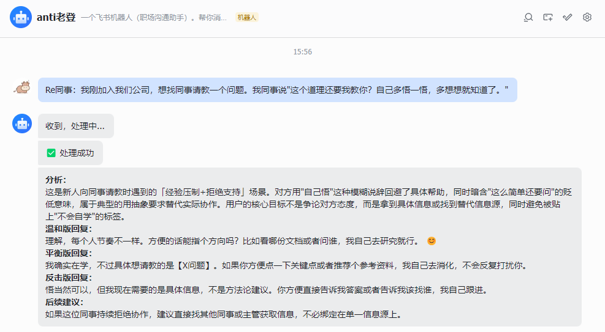

<!-- <p align="center">
  
</p> -->

<h1 align="center">Anti老登</h1>

<!-- > <p align="center"><em>"语言是窗户，否则它们就是墙。" —— 马歇尔·卢森堡</em></p> -->

<p align="center"><strong> 职场登味过滤器 · 回怼生成器 · 反PUA伙伴</strong></p>


<p align="center">领导画饼？同事甩锅？升职加薪被"你还年轻"一句带过？<br/>把话发给飞书机器人，马上出对策。</p>

---

## 💥 它能帮你做什么

| 你的处境 | Anti老登帮你 |
|--------|-------------|
| 准备发给下属的话，自己都觉得有点“登” | **去登味**：自动揪出登味，给你干净版本 |
| 同事阴阳你：“这个道理还要我教你？” | **回登话**：拆套路 + 得体回法，直接抄作业 |
| 领导说：“我吃过的盐比你吃过的饭多” | 秒回你 **3 套不卑不亢的话术** |

⚡️ 常见话术 **秒回**，复杂场景走LLM

> **本地 18 个话术家族 + 1600+ 模板** 模糊匹配高频登味，常见话术 **秒回**；
没命中就自动切到 **大模型**。

💬 飞书私聊直接用，不用学命令

> 你只需要：
> - 发 `To：...` → 帮你去登味 
> - 发 `Re领导：...` → 教你怎么回

---

## 🎯 示例场景

**场景一：领导 PUA 你**

> 领导说："趁年轻多吃点苦，对你以后有好处。现在舒服了，以后就要吃大亏。"

Bot 拆招 →

> **分析：** 典型的"道德绑架+经验压制"组合话术——用"趁年轻吃苦"把加班包装成对你的栽培，用"以后吃大亏"制造焦虑和服从。
>
> **温和版回复：** 谢谢您的关心 😊 我会合理安排工作节奏，目前手上的任务会按优先级推进，确保交付质量。
>
> **反击版回复：** 关于加班安排，我需要确认具体的任务目标、优先级和截止时间，这样我才能合理规划。如果是常态化996，我想了解一下这个安排是否经过公司正式审批，以及加班补偿方案是怎样的。


**场景二：你不小心说话带登味**

> 你想对下属说："你这个需求很简单啊，我感觉上周就该搞定了吧？"

Bot 预检 →

> **登味来源：**「很简单啊」隐含了对下属能力的贬低——你连这么简单的事都做不完？「我感觉上周就该搞定了吧」用个人感觉代替明确的截止日期，既施加了压力又没有给出客观依据。
>
> **温和版改写：** 这个需求原定上周交付，目前看还没完成，想了解一下是遇到了什么卡点吗？如果有需要协调的资源或优先级冲突，咱们一起看看怎么解决 🤝
>
> **直接版改写：** 这个需求已经超过原定截止日期一周，我需要你今天内反馈：当前完成到什么程度、卡在哪里、预计什么时候能交付。如果有依赖项没解决，现在就提出来。

**场景三：领导用比较push你**

> 领导说："我就不明白了，你和 xxxx 都是一个脑袋两个肩膀，吃的是一样的饭，上的也是一样的班，人家能做出来，你为什么就做不出来？"

Bot 拆招 →

> **分析：** 典型的"公开比较+羞辱式批评"叠加"抽象人格否定"。领导用同事做参照物进行人身比较，而非指出具体的技术卡点或资源差异，本质上是用羞耻感施压而非提供有效反馈。
>
> **温和版回复：** 收到您的反馈，我会再梳理一下卡住的环节 👍 方便的话，能指点一下具体是哪几个技术点我需要重点突破吗？这样我调整起来更有方向。
>
> **反击版回复：** 进度确实不理想，我在推进。不过每个人卡点不同，直接对比不太能帮我定位问题。我需要的是具体告诉我哪个环节的产出不达标、标准是什么，我今天整理一份卡点清单和所需支持发给您。

**场景四：谈涨薪被画饼**

> 你提了涨薪，领导说："年轻人不要总盯着钱，格局要大一点，多做点奉献。"

Bot 拆招 →

> **分析：** 典型的"道德绑架回避实质问题"场景。领导用"格局""奉献"等抽象道德词汇，把一个合理的薪资诉求转化成了态度问题，回避了对薪资标准、调整条件和时间节点的正面回应。
>
> **温和版回复：** 
谢谢您的提醒，我会继续努力。不过我也想了解一下，目前达到什么样的具体成果，就可以正式进入薪资调整的流程呢？ 😊

> **反击版回复：** 
关于格局和奉献我理解您的意思，但薪资是劳动对价，不是态度问题。我想请您明确：达到哪些可量化的成果、在什么时间节点，可以启动薪资调整流程？如果目前没有空间，也请直接告诉我，我好做自己的规划。

---

## 📱 界面预览

<p align="center"></p>

---

## 📖 使用说明

私聊 bot，直接发消息就行。两种玩法：

**回登话** — 别人甩来的登味，帮你拆招：
```
Re领导：我领导说"我吃过的盐比你吃过的饭多，你听我的总没错。"
Re同事：我同事说"这个道理还要我教你？自己多悟一悟。"
```

**去登味** — 你准备发出去的话，帮你预检：
```
To：季度复盘后一对一沟通，我想鼓励组员多承担一些："你表现还行，但跟同期进来的小王比还是差了一截。"
```

不加 To/Re 也行，bot 会自动判断。加 Re领导/Re同事 更精准。

### 其他功能

bot 还支持以下操作，均以按钮形式呈现：

| 功能 | 说明 |
|---|---|
| 使用说明 | 查看完整使用指南 |
| 取消 | 取消处理中的请求 |
| 查看当前模型 | 查看正在使用的模型 |
| 切换模型 | 支持切换到开发者预设的支持模型 |

模型切换只影响当前私聊会话，不改全局默认值，重启服务后恢复默认。

---

## 🚀 部署配置

### 一、服务端配置

#### 1. 安装依赖

```bash
pip install -r requirements.txt
```

#### 2. 编辑配置文件

复制 `config.example.yaml` 为 `config.yaml`，填入飞书应用凭证和 OpenRouter API Key：

```yaml
feishu:
  app_id: "cli_xxxxxxxxxx"
  app_secret: "xxxxxxxxxx"

backend:
  api_key: "sk-or-xxx"
  model: "anthropic/claude-opus-4.6"
```

可切换的模型也在配置文件里管理，改 `model_presets` 即可，不用动代码：

```yaml
model_presets:
  claude-opus-4.6: "anthropic/claude-opus-4.6"
  deepseek-v3.2: "deepseek/deepseek-chat-v3-0324:free"
  glm5.1: "z-ai/glm-5.1"
  kimi-k2.5: "moonshotai/kimi-k2.5"
```

#### 3. 启动

```bash
python3 feishu_bot_mvp/server.py
```

### 二、飞书机器人配置

在 [飞书开放平台](https://open.feishu.cn/app) 创建企业自建应用，完成以下配置：

1. **创建应用**：记下 App ID 和 App Secret，填入 `config.yaml`
2. **开通机器人能力**：应用能力 → 添加机器人
3. **配置事件订阅**：选择长连接模式，添加 `im.message.receive_v1` 事件
4. **配置权限**：开通 `im:message`、`im:message.p2p_msg:readonly`、`im:message:send_as_bot` 等权限
5. **发布应用**：创建版本并发布

> 详细的飞书机器人配置步骤见 [docs/feishu-bot-config.md](docs/feishu-bot-config.md)

---

## ⚙️ 工作原理

```
用户发消息 → 飞书长连接推送 → 前缀路由（To/Re/自动推断）
                                    ↓
                          本地话术库模糊匹配（18 个家族，1600+ 模板）
                             ↓ 命中              ↓ 未命中
                          秒回结果         → 发"收到，处理中..."
                                                  ↓
                                          模型后端生成（OpenRouter）
                                                  ↓
                                          富文本回复（加粗 + emoji）
```

- **本地话术库**覆盖高频老登话术，基于模糊匹配，不是死关键词
- **模型后端**处理复杂/少见的表达，返回结构化 JSON，格式化后发送
- **命令**（使用说明、取消、模型切换）在事件接收线程立即处理，不排队

---

## 📁 项目结构

```
anti-laodeng/
  SKILL.md                          # LLM 技能定义：改写公式 + 行为约束
  references/
    red-flags.md                    # 老登信号识别清单
    rewrite-patterns.md             # 改写公式和示例
    scene-checklists.md             # 场景检查表

feishu_bot_mvp/
  server.py                         # 主入口：飞书接入、路由、后端调用
  fast_path_bank.py                 # 本地话术库 + 模糊匹配（18 家族，1600+ 模板）
  counter_strategy_bank.py          # 来话拆招策略和回复生成
  review_schema.json                # 发前预检 JSON schema
  counter_schema.json               # 来话拆招 JSON schema
  prompts/
    review_system.txt               # To 模式 system prompt 模板
    review_user.txt                 # To 模式 user prompt 模板
    counter_system.txt              # Re 模式 system prompt 模板
    counter_user.txt                # Re 模式 user prompt 模板

docs/
  feishu_config.md                  # 飞书应用配置详细步骤

config.yaml                         # 配置文件（不入仓库）
config.example.yaml                 # 配置文件模板
```

---

## ❓ 常见问题

**为什么有时候秒回，有时候要等几秒？**
常见话术命中本地话术库，秒回；复杂表达走模型后端，需要等 API 响应。

**为什么不做自动代发？**
只做"建议与改写"，不替你发给别人。避免误发，避免过度自动化。

**启动后飞书没收到消息？**
检查：应用是否已发布、事件是否订阅了 `im.message.receive_v1`、事件模式是否选了长连接。详见 [docs/feishu_config.md](docs/feishu_config.md)。

**Bot 收到消息但没回复？**
检查 `im:message:send_as_bot` 权限是否已开通并审批通过。

---

## 💬 交流群

欢迎加入微信群，聊聊职场反登心得、提需求、报 bug：

<p align="center"></p>

---
