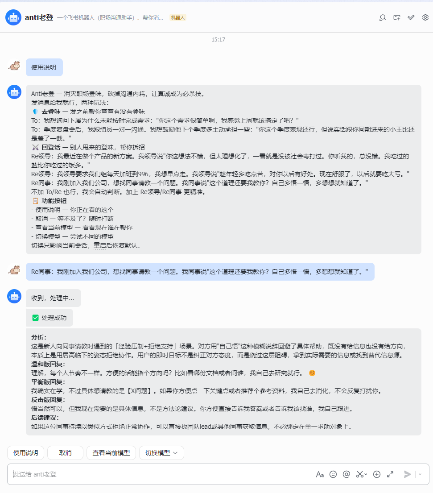
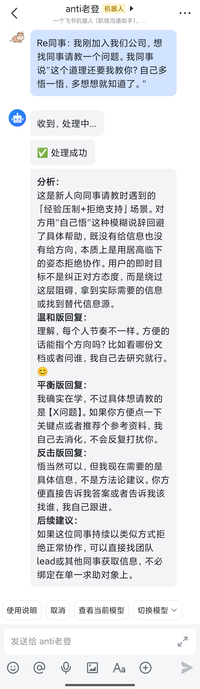

<p align="center">
  
</p>

<h1 align="center">Anti老登</h1>

<p align="center">拒绝登味，拒绝内耗。</p>

一个飞书机器人（职场沟通助手）。帮你消灭职场登味、砍掉沟通内耗，让真诚成为必杀技。

两大核心功能：

- **去登味（To 模式）**：你准备发出去的话，bot 帮你预检——找出里面不小心带的登味，给出改写建议
- **回登话（Re 模式）**：别人甩过来的登味话术，bot 帮你拆招——分析套路，给出得体的应对方案

---

## 效果预览

桌面端：



移动端：



---

## 快速体验

不接飞书也能直接试：

```bash
# 安装依赖
pip install -r requirements.txt

# 去登味
python3 feishu_bot_mvp/server.py --review "To：季度复盘会后，我跟组员一对一沟通。我想鼓励他下个季度多主动承担一些："你这个季度表现还行，但说实话跟你同期进来的小王比还是差了一截。""

# 回登话
python3 feishu_bot_mvp/server.py --review "Re同事：我刚加入我们公司，想找同事请教一个问题。我同事说 "这个道理还要我教你？自己多悟一悟，多想想就知道了。""
```

常见话术秒回（本地话术库命中），复杂表达走模型后端（需配置 API key）。

---

## 飞书里怎么用

私聊 bot，直接发消息。

### 去登味（To 模式）

检查你准备发出去的话有没有登味，给出改写建议。适合发消息前自查。

```
To：我想询问下属为什么未能按时完成需求："你这个需求很简单啊，我感觉上周就该搞定了吧？"
```

```
To：季度复盘会后，我跟组员一对一沟通。我想鼓励他下个季度多主动承担一些："你这个季度表现还行，但说实话跟你同期进来的小王比还是差了一截。"
```

### 回登话（Re 模式）

分析别人甩过来的话术套路，给出得体的应对方案。可以指定对方身份：

```
Re领导：我最近在做个产品的新方案。我领导说"你这想法不错，但太理想化了，一看就是没被社会毒打过。你听我的，总没错。我吃过的盐比你吃过的饭多。"
```

```
Re领导：我最近在做个项目开发，死活做不出来。我领导批评我说"我就不明白了，你和xxxx都是一个脑袋两个肩膀，吃的是一样的饭，上的也是一样的班，人家能做出来，你为什么就做不出来？"
```

```
Re同事：我刚加入我们公司，想找同事请教一个问题。我同事说"这个道理还要我教你？自己多悟一悟，多想想就知道了。"
```

不加前缀也行，bot 会自动判断你是想去登味还是回登话。

### 其他功能

bot 还支持以下操作，均以按钮形式呈现：

| 功能 | 说明 |
|---|---|
| 使用说明 | 查看完整使用指南 |
| 取消 | 取消处理中的请求 |
| 查看当前模型 | 查看正在使用的模型 |
| 切换模型 | 支持切换到开发者预设的支持模型 |

模型切换只影响当前私聊会话，不改全局默认值，重启服务后恢复默认。

---

## 部署配置

### 配置文件

#### 1. 安装依赖

```bash
pip install -r requirements.txt
```

#### 2. 编辑配置文件

复制 `config.example.yaml` 为 `config.yaml`，填入飞书应用凭证和 OpenRouter API Key：

```yaml
feishu:
  app_id: "cli_xxxxxxxxxx"
  app_secret: "xxxxxxxxxx"

backend:
  api_key: "sk-or-xxx"
  model: "anthropic/claude-opus-4.6"
```

可切换的模型也在配置文件里管理，改 `model_presets` 即可，不用动代码：

```yaml
model_presets:
  claude-opus-4.6: "anthropic/claude-opus-4.6"
  deepseek-v3.2: "deepseek/deepseek-chat-v3-0324:free"
  glm5.1: "z-ai/glm-5.1"
  kimi-k2.5: "moonshotai/kimi-k2.5"
```

#### 3. 启动

```bash
python3 feishu_bot_mvp/server.py
```

### 飞书机器人配置

在 [飞书开放平台](https://open.feishu.cn/app) 创建企业自建应用，完成以下配置：

1. **创建应用**：记下 App ID 和 App Secret，填入 `config.yaml`
2. **开通机器人能力**：应用能力 → 添加机器人
3. **配置事件订阅**：选择长连接模式，添加 `im.message.receive_v1` 事件
4. **配置权限**：开通 `im:message`、`im:message.p2p_msg:readonly`、`im:message:send_as_bot` 等权限
5. **发布应用**：创建版本并发布

> 详细的飞书机器人配置步骤见 [docs/feishu_config.md](docs/feishu_config.md)

---

## 模型后端

本地话术库没命中时，走模型后端（OpenRouter）。默认模型和可切换模型均在 `config.yaml` 中配置。

在飞书聊天中可随时切换模型，支持 Claude、DeepSeek、GLM、Kimi 等。

---

## 工作原理

```
用户发消息 → 飞书长连接推送 → 前缀路由（To/Re/自动推断）
                                    ↓
                          本地话术库模糊匹配（18 个家族，1600+ 模板）
                             ↓ 命中              ↓ 未命中
                          秒回结果         → 发"收到，处理中..."
                                                  ↓
                                          模型后端生成（OpenRouter）
                                                  ↓
                                          富文本回复（加粗 + emoji）
```

- **本地话术库**覆盖高频老登话术，基于模糊匹配，不是死关键词
- **模型后端**处理复杂/少见的表达，返回结构化 JSON，格式化后发送
- **命令**（使用说明、取消、模型切换）在事件接收线程立即处理，不排队

---

## 项目结构

```
anti-laodeng/
  SKILL.md                          # LLM 技能定义：改写公式 + 行为约束
  references/
    red-flags.md                    # 老登信号识别清单
    rewrite-patterns.md             # 改写公式和示例
    scene-checklists.md             # 场景检查表

feishu_bot_mvp/
  server.py                         # 主入口：飞书接入、路由、后端调用
  fast_path_bank.py                 # 本地话术库 + 模糊匹配（18 家族，1600+ 模板）
  counter_strategy_bank.py          # 来话拆招策略和回复生成
  review_schema.json                # 发前预检 JSON schema
  counter_schema.json               # 来话拆招 JSON schema
  prompts/
    review_system.txt               # To 模式 system prompt 模板
    review_user.txt                 # To 模式 user prompt 模板
    counter_system.txt              # Re 模式 system prompt 模板
    counter_user.txt                # Re 模式 user prompt 模板

docs/
  feishu_config.md                  # 飞书应用配置详细步骤

config.yaml                         # 配置文件（不入仓库）
config.example.yaml                 # 配置文件模板
```

---

## 常见问题

**为什么有时候秒回，有时候要等几秒？**
常见话术命中本地话术库，秒回；复杂表达走模型后端，需要等 API 响应。

**为什么不做自动代发？**
只做"建议与改写"，不替你发给别人。避免误发，避免过度自动化。

**启动后飞书没收到消息？**
检查：应用是否已发布、事件是否订阅了 `im.message.receive_v1`、事件模式是否选了长连接。详见 [docs/feishu_config.md](docs/feishu_config.md)。

**Bot 收到消息但没回复？**
检查 `im:message:send_as_bot` 权限是否已开通并审批通过。

---
