# 飞书机器人配置指南

本文档介绍如何在飞书开放平台创建并配置 anti-laodeng 机器人应用。

## 1. 创建企业自建应用

登录 [飞书开放平台](https://open.feishu.cn/)，点击「创建企业自建应用」。

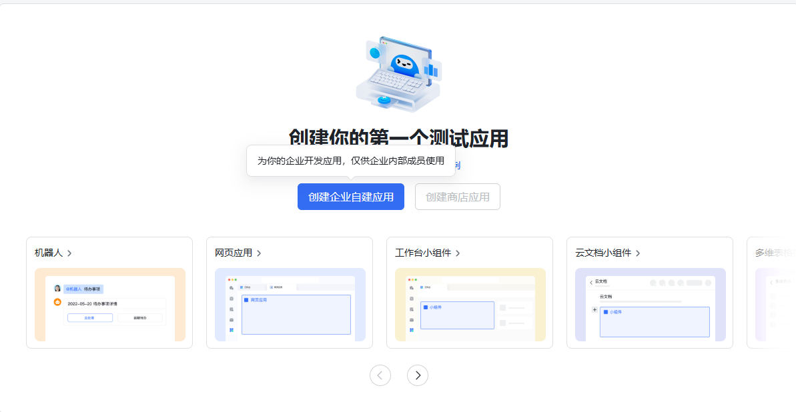

## 2. 填写应用信息

填写以下内容：

- **应用名称**：`anti老登`（或你喜欢的名称）
- **应用描述**：输入你的应用描述
- **应用图标**：选择你喜欢的图标和背景色

填写完成后点击「创建」。

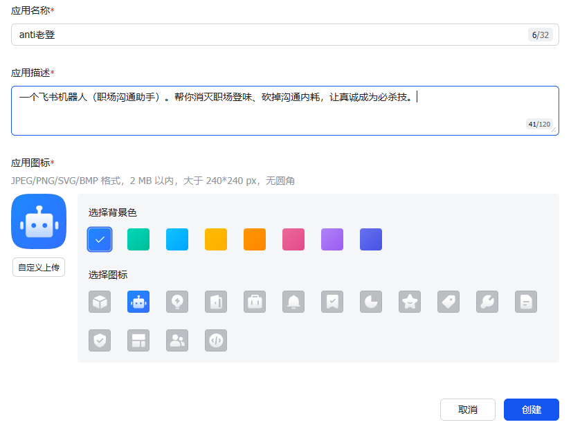

## 3. 添加应用能力

进入应用详情页，在「添加应用能力」中选择添加「机器人」。

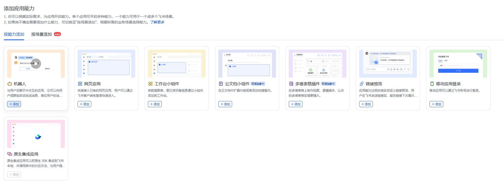

## 4. 配置机器人自定义菜单

选择进入左侧「机器人」配置页面，设置机器人的自定义菜单。在菜单配置中选择“发送文字消息”。目前支持“使用说明”、“取消”、“查看当前模型”、“切换模型”菜单。“切换到xxx模型”可以由开发者自己设置，在_DEFAULT_MODEL_PRESETS设置好映射即可。

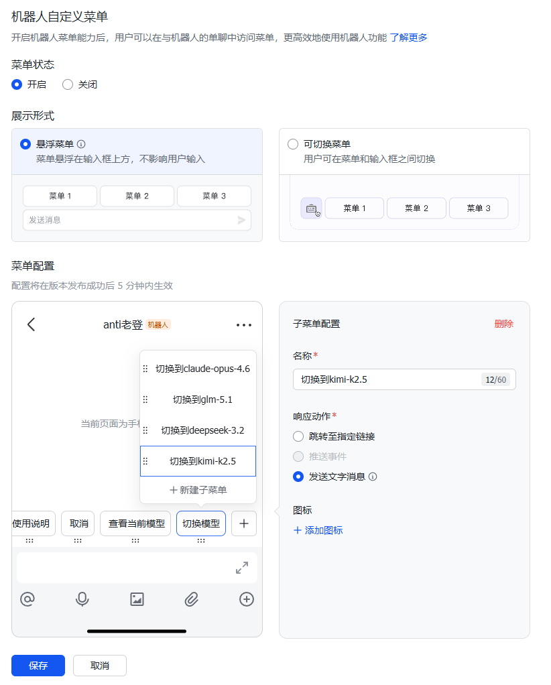

## 6. 配置权限

选择进入左侧「权限管理」页面，搜索并开通以下权限：

- 获取与发送单聊、群组消息
- 读取用户发给机器人的单聊消息
- 以应用的身份发消息
- 获取单聊、群组消息

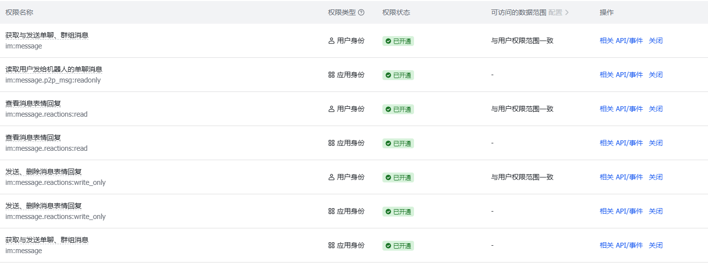

建议同时开通应用身份权限和用户身份权限。不同的权限可以多次选择一次开通。

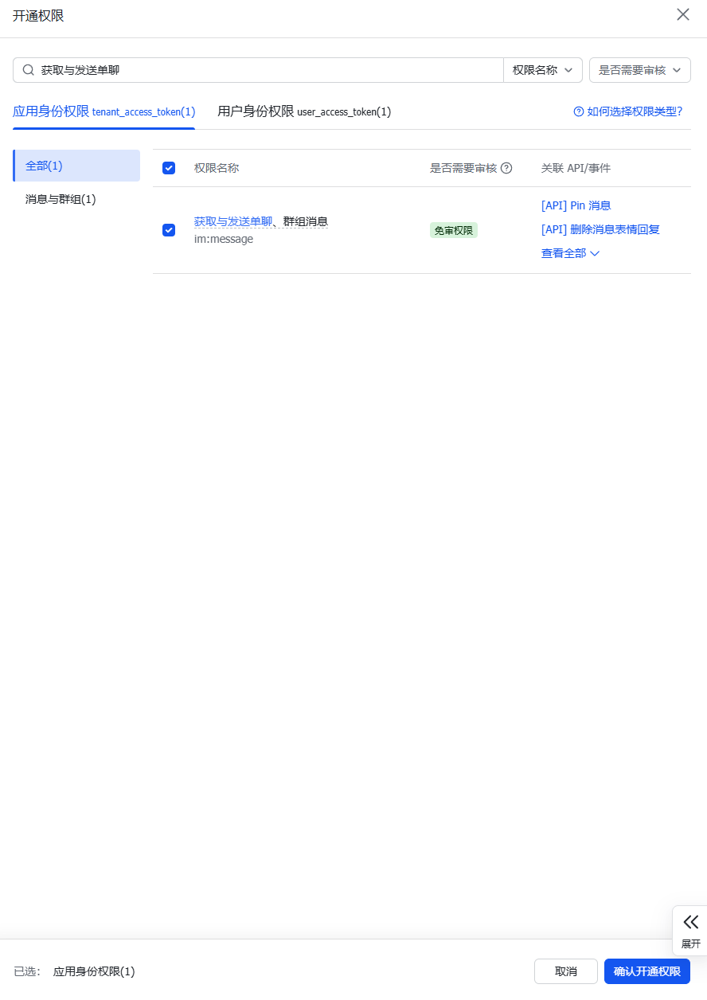

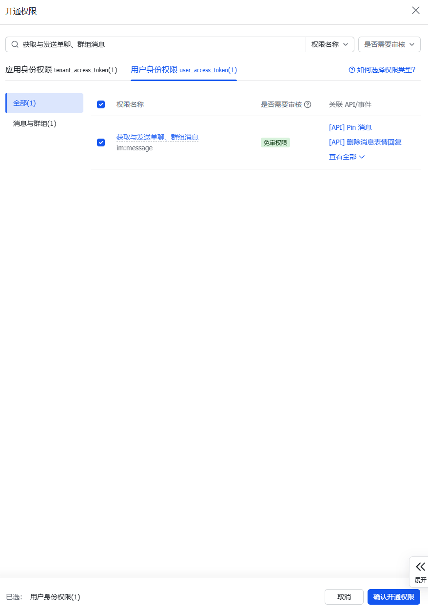

## 8. 配置事件订阅

进入「事件订阅」页面：

- **订阅方式**：选择「使用长连接接收事件」（推荐）
- 该方式无需注册公网域名或配置加密策略，仅需使用官方 SDK 启动长连接飞书客户端
- 在应用未发布时，验证失败是正常的，无需在意

配置完成后点击「保存」。

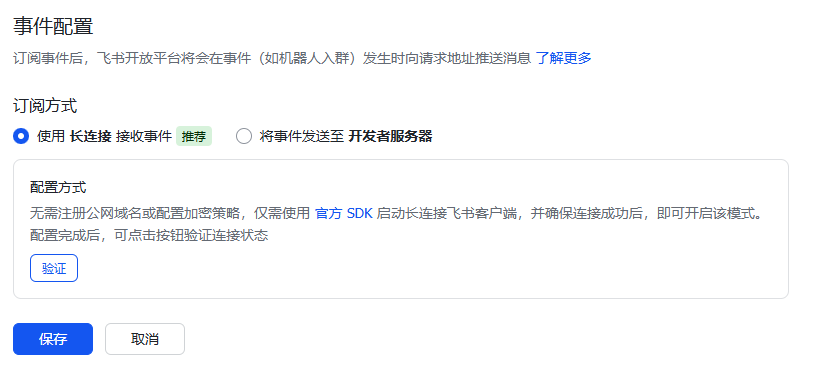

## 9. 添加事件

点击「添加事件」，搜索 `im.message.receive_v1`，勾选「接收消息 v2.0」事件（用户发送新消息至机器人或群聊后推送事件通知）。点击「添加」。

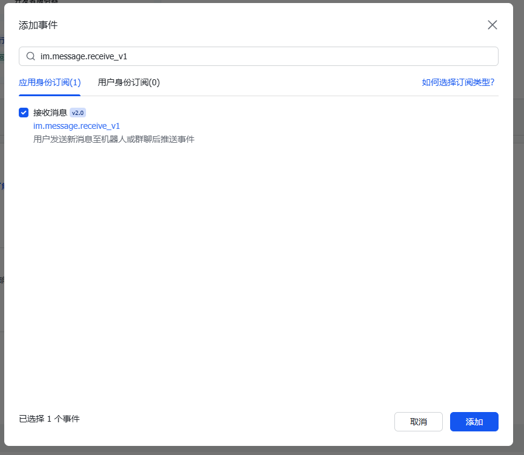

## 10. 创建版本并发布

进入「版本管理与发布」，填写以下信息：

- **应用版本号**：`0.0.1`
- **移动端的默认能力**：机器人
- **桌面端的默认能力**：机器人
- **更新说明**：填写版本说明
- **可用范围**：设置可用成员

确认以下配置已生效：
- 应用能力：机器人（已启用）
- 事件订阅变更：使用长连接接收事件

填写完成后点击「保存」并提交发布。

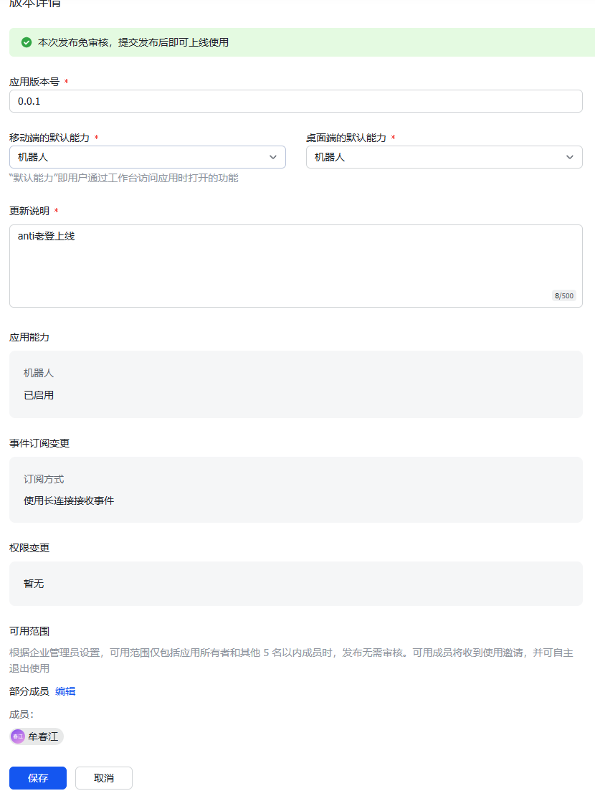

## 11. 发布成功

可用范围在 5 名以内成员时，发布免审核，提交后即可上线。发布成功后会收到「开发者小助手」的通知。

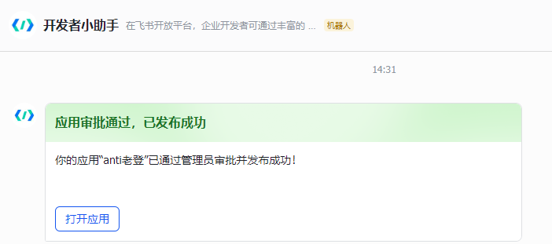

## 12. 获取应用凭证

发布成功后，在应用详情页「凭证与基础信息」中获取以下信息，配置到 `config.yaml` 文件：

- **App ID** → `FEISHU_APP_ID`
- **App Secret** → `FEISHU_APP_SECRET`

## 下一步

完成飞书机器人配置后，参考项目 README 配置 `config.yaml` 文件并启动服务。
