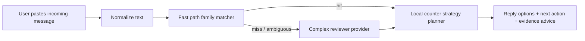

# Incoming Counter Logic

## Goal

Design a second capability beside the current "发前老登预检":

- current capability: review the user's outgoing draft before sending
- new capability: analyze an incoming 老登-style message from a colleague or manager and suggest a low-risk counter move

The goal is not to "win the argument".

The goal is to protect four things, directly taken from [howtocounterlaodeng.txt](/Users/qszhang/Documents/codex/laodeng/howtocounterlaodeng.txt):

- protect delivery
- protect boundaries
- protect evidence
- protect options

## Reuse The Current Architecture

The new feature should reuse the same two-stage architecture we already have:

1. local fast path first
2. complex-model fallback second

Map it onto the current code like this:

- local matcher: reuse `feishu_bot_mvp/fast_path_bank.py`
- complex fallback: reuse the existing provider abstraction in `feishu_bot_mvp/server.py`
- new logic layer: add an "incoming counter planner" that takes matched family keys plus sender role and outputs reply strategy

So the architecture becomes:



## Product Intent

This feature should not only say "this is 老登".
It should answer:

- what kind of pressure this is
- what the safest immediate goal is
- what to reply right now
- what to do after replying
- whether to leave evidence or escalate

## Input Contract

The minimum input should be:

```json
{
  "incoming_text": "别跟我解释了，今晚必须给我结果。",
  "sender_role": "manager"
}
```

Recommended `sender_role` values:

- `manager`
- `peer`
- `skip_level`
- `unknown`

Optional fields:

```json
{
  "channel": "dm|group|meeting|email|unknown",
  "need": "protect_delivery|protect_boundary|protect_record|unknown",
  "user_preference": "soft|balanced|firm"
}
```

## Core Logic

### Step 1. Detect Pressure Family

Reuse the existing local fast-path bank instead of building a separate classifier.

Current family keys already cover most useful incoming patterns:

- `hard_deadline_push`
- `deny_explanation`
- `result_only`
- `abstract_criticism`
- `attitude_problem`
- `seniority_override`
- `for_your_own_good`
- `family_boundary`
- `gratitude_pressure`
- `public_shame`
- `comparison_humiliation`
- `overtime_loyalty`
- `stability_control`
- `blame_shift`
- `obedience_first`
- `emotional_blackmail`
- `upward_face_pressure`
- `boundary_mocking`

Implementation suggestion:

- refactor `FastReviewer` to expose a lower-level analysis method
- instead of only returning the final outgoing-review text, it should also return:

```json
{
  "matched_families": ["deny_explanation", "hard_deadline_push"],
  "scene": "催进度/催交付",
  "risk_level": "high",
  "style": "progress"
}
```

This same analysis can drive both:

- outgoing rewrite
- incoming counter strategy

### Step 2. Convert Family Into Counter Goal

This is the most important new layer.

Each family should map to a counter goal, not just a label.

Recommended mapping:

| Family | Immediate Goal |
|---|---|
| `hard_deadline_push` | force priority clarification |
| `deny_explanation` | reopen factual risk channel without arguing |
| `result_only` | ask for owner / deadline / tradeoff |
| `abstract_criticism` | pull criticism back to observable facts |
| `attitude_problem` | refuse identity frame, ask for concrete issue |
| `seniority_override` | stop debating worldview, ask for current criteria |
| `for_your_own_good` | translate care/control back into task boundary |
| `family_boundary` | keep friendliness, restore work boundary |
| `gratitude_pressure` | reject moral debt frame, return to scope |
| `public_shame` | stop loss now, move discussion to private follow-up |
| `comparison_humiliation` | stop comparison, request concrete gap |
| `overtime_loyalty` | force priority choice / duration / compensation |
| `stability_control` | keep agency, ask for objective tradeoff |
| `blame_shift` | rebuild timeline and dependency facts |
| `obedience_first` | comply narrowly, ask for written scope afterward |
| `emotional_blackmail` | avoid emotional defense, return to actionable next step |
| `upward_face_pressure` | turn pressure into decision checkpoint |
| `boundary_mocking` | do not defend feelings, restate capacity and boundary |

### Step 3. Add Sender-Role Policy

The same family should produce different response styles depending on who sent it.

#### If sender is `manager`

Primary rule:

- do not directly fight value judgments
- acknowledge direction
- convert into priority, scope, deadline, or written confirmation

Default response posture:

- `acknowledge -> translate -> confirm`

#### If sender is `peer`

Primary rule:

- do not accept peer-to-peer domination frames
- keep tone calm
- ask for facts, boundary, and explicit dependency

Default response posture:

- `clarify -> narrow scope -> document`

#### If sender is `skip_level`

Primary rule:

- reduce emotional content fast
- avoid overcommitting alone
- move toward written summary and owner clarity

Default response posture:

- `acknowledge -> align -> written record`

## Local Counter Strategy Planner

This should be a new local planner module, for example:

- `feishu_bot_mvp/counter_strategy_bank.py`

Each family should have:

- counter goal
- reply tone by role
- next action
- evidence advice
- escalation signal

Suggested internal shape:

```json
{
  "family_key": "deny_explanation",
  "role_variants": {
    "manager": {
      "goal": "reopen factual risk channel",
      "reply_soft": "收到，我先不展开解释。为了按时推进，我 20 分钟内给您一版当前状态、阻塞点和预计完成时间。",
      "reply_balanced": "收到。我先按结果推进，同时把当前阻塞点和完成时间发您，避免最后才暴露风险。",
      "reply_firm": "收到，我先执行。涉及交期的阻塞我会同步成书面清单，请您一起确认优先级和取舍。 ",
      "follow_up": "会后书面确认：目标、截止时间、阻塞点、是否需要调优先级。",
      "evidence": "建议书面留痕",
      "escalate": false
    },
    "peer": {
      "goal": "stop peer pressure and move back to facts",
      "reply_soft": "我先把现状同步给你：当前卡点是 X，预计 Y 时间给你明确结果。",
      "reply_balanced": "我会继续推进，但需要把卡点说清楚，不然你那边也不好安排。",
      "reply_firm": "我可以配合推进，但需要先把依赖和完成时间对齐，不然口头催办解决不了问题。",
      "follow_up": "若跨团队依赖明显，建议转书面确认。",
      "evidence": "必要时群里确认",
      "escalate": false
    }
  }
}
```

## Output Contract

The incoming-counter feature should return more than one reply.

Recommended response object:

```json
{
  "risk_level": "high",
  "scene": "催进度/催交付",
  "sender_role": "manager",
  "matched_families": ["deny_explanation", "hard_deadline_push"],
  "counter_goal": "reopen factual risk channel and force priority clarity",
  "recommended_mode": "acknowledge_translate_confirm",
  "reply_soft": "收到，我先不展开解释。为了按时推进，我 20 分钟内给您一版当前状态、阻塞点和预计完成时间。",
  "reply_balanced": "收到。我先按结果推进，同时把当前阻塞点和完成时间发您，避免最后才暴露风险。",
  "reply_firm": "收到，我先执行。涉及交期的阻塞我会同步成书面清单，请您一起确认优先级和取舍。",
  "follow_up_action": "会后发一条书面确认，写清目标、截止时间、阻塞点和取舍。",
  "evidence_advice": "建议留痕",
  "escalation_hint": "暂不升级",
  "why": "对方当前在压缩解释空间，如果你继续正面解释，容易被打成态度问题。"
}
```

## A Simple Decision Tree

### Case A. Boss pushes deadline and blocks explanation

Detected families:

- `hard_deadline_push`
- `deny_explanation`

Best local logic:

1. do not argue whether the tone is fair
2. reply with narrow acknowledgment
3. put back one factual risk channel
4. follow with written status

Good reply:

- “收到，我先按结果推进。为了避免最后才暴露风险，我 20 分钟内把当前状态、阻塞点和预计完成时间发您确认。”

### Case B. Boss uses abstract labels

Detected families:

- `abstract_criticism`
- `attitude_problem`

Best local logic:

1. do not defend identity
2. ask for concrete gaps
3. commit to correction path

Good reply:

- “收到，我先把这次结果补上。为了改到位，您方便说下这次最关键的两个具体问题点吗？我按优先级改。”

### Case C. Peer uses relationship pressure

Detected families:

- `family_boundary`
- `for_your_own_good`

Best local logic:

1. stay friendly
2. refuse fake intimacy as obligation
3. translate back to scope and timeline

Good reply:

- “我理解你是想把事情推进快一点。我这边可以配合，但还是按任务范围和当前排期来，咱们把截止时间和依赖定清楚。”

### Case D. Public shaming in a meeting or group

Detected families:

- `public_shame`
- `comparison_humiliation`

Best local logic:

1. do not fight in public
2. stop loss first
3. move to private written follow-up

Good reply:

- “收到，这个问题我先记下。会后我把原因、修复动作和时间点发出来，先把事情收住。”

## How To Reuse The Existing Local Template Machine

The current local machine should be reused in two ways.

### Reuse 1. Shared Family Detection

Do not create a separate detector for incoming messages.

Instead:

- keep one shared matcher in `fast_path_bank.py`
- expose `analyze(text)` or `match_families(text)`
- let different downstream planners consume the same family keys

### Reuse 2. Shared Scene Vocabulary

Keep the same scene taxonomy:

- `催进度/催交付`
- `反馈/批评`
- `说教/关系绑架`
- `会议/公开施压`
- `加班/边界施压`
- `资历/权威压制`

This keeps:

- stats coherent
- fast-path coverage reusable
- complex fallback prompt simpler

## Complex Fallback Logic

If the local matcher misses or the message is mixed / ambiguous:

- route to the same complex provider abstraction already used by the current bridge
- but change the prompt target

Instead of:

- "rewrite my outgoing message"

ask:

- "analyze this incoming workplace message and suggest the safest counter move"

This means the provider layer can stay the same:

- `openrouter`
- `codex`
- `compatible`

Only the planner prompt changes.

## Integration Into The Current Bot

Recommended product split:

### Outgoing Mode

- current behavior
- user pastes a draft they want to send

### Incoming Counter Mode

- user pastes a message they received
- user optionally marks who sent it:
- `领导发我的`
- `同事发我的`

For MVP, the easiest detection is explicit user intent in natural language.

Examples:

- “领导刚刚这么跟我说，我该怎么回：……”
- “同事发我这句有点登，我怎么低风险回：……”

Later, if needed, a lightweight intent classifier can decide between:

- outgoing review
- incoming counter

## What The Feature Should Return To The User

The final UX should be short and practical:

1. what kind of pressure this is
2. what your immediate goal should be
3. one low-risk reply
4. one firmer reply
5. whether to留痕 / 转书面 / 升级

## Recommended Next Engineering Step

If implementing this next, the clean sequence is:

1. refactor `FastReviewer` to expose family-match analysis
2. add `counter_strategy_bank.py`
3. add `IncomingCounterPlanner`
4. add a second prompt path for complex fallback
5. wire an intent switch in the bot

## Bottom Line

The best implementation is not a second independent model prompt.

It is:

- one shared local detector
- two downstream planners
- outgoing planner for "how not to sound 登"
- incoming planner for "how to respond without getting eaten"

That design matches the current codebase and gets maximum value out of the existing local template bank.
